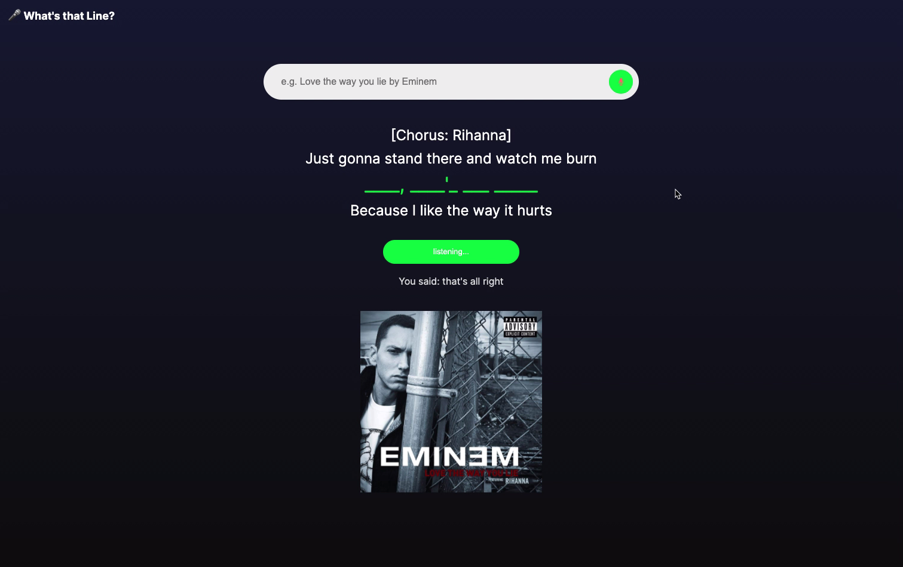

# 🎤 What's That Line?

[Live demo on glitch](https://whats-that-line.glitch.me/)

YouTube Demo

[](http://www.youtube.com/watch?v=7a0ocnkS0Gg "What's that Line")

## About

**"What's that line?"** is an online lyrics quiz app built with the `Speech Recognition` functionality from the [Web Speech API](https://developer.mozilla.org/en-US/docs/Web/API/Web_Speech_API), altogether with a lyrics api from [APISEEDS](https://apiseeds.com/documentation/lyrics), and another lyrics API from [Genius.com](https://docs.genius.com/).

## Inspiration

I miss and crave going to Karaoke in K-Town, especially in this crazy COVID time. Singing at home without holding the microphone and facing the screen is just a completely different experience. Often times, I couldn't sing a song which I am not so familiar with perfectly without looking at the running lyrics on a screen. So I guess I can build a tool for my own self to strengthen my memory of whatever song I like, then I can sing them without looking at the lyrics.

## How it works

Users start the quiz by searching a song with their voice, by saying "A song by an artist" (e.g. Love the way you lie by Eminem). Four lines of lyrics, including the hidden line will be shown on the screen. Users have to say the line to the computer in order the complete the missing line.

## Choosing APIs

It took me quite a while to settle on the APIs that provide me the right function that I need, and also easy to be set up. I did digging through the API docs from multiple services. First I came across [Genius.com](https://docs.genius.com/). It looked like the perfect API, before I found it is not providing the lyrics, but everything else. I moved on to and again gave up on [Musixmatch API](https://developer.musixmatch.com/), as it does not provide the full lyrics (unless you go pro).

Then I stumbled upon the API provided by [APISEEDS](https://apiseeds.com/documentation/lyrics). It works well for me. Despite the fact that it is not free, I have 10,000 free credits to work with. Eventually, I brought the Genius API back for just displaying the corresponding album art, which is not the focus of this project, as the icing on the cake.

## Coding

I code the project with the mindset of "most functionality with the least time spent", so the code might not be the most structured and efficient (,but there should be no bugs, I hope). I could have refactor this but I guess it is adequate for a one-week project.

### Setting up the API

I am not very experienced in working with private APIs. I used to find and use public ones for my projects from this [list on GitHub](https://github.com/public-apis/public-apis). I know there will be problems of dealing with `CORS` lying ahead. I first try to call the API and try to look at the result with [`Postman`](https://www.postman.com/), which was very helpful that I can do everything in a controllable environment, instead of messing with wrong code.

I consider making this project a `node.js` project at the very begining, as I know this is the way to "do it properly", and I don't have to worry about disclosing my API credentials anymore, as I can hide them in the backend. After some research, I decided to go the low tech way, "input the API keys from the user", instead of developing this as a `node.js` app, as it was not as easy as it seemed (maybe), while I found no easy-to-follow tutorials online. But I guess the idea will be, with `express`, the static code call the API served by it's own `endpoints`, where they are rerouted to the external APIs. But again, I don't have a crystal clear picture of how it should work in a complete picture. Maybe it can be the next assignment for myself.

Below is how the lyrics is obtained from the API call, and how I processed the data for later use. Please refer to the inline comments for detailed explanation.

``` javascript
let getLyrics = async () => {
    // templating string, and Api key is not written in the URL
	fetch(`https://orion.apiseeds.com/api/music/lyric/${artist}/${track}?apikey=${lyricsApiKey}`, {
		mode: "cors"
	}).
	then(response => response.json()).
	then(data => {
        // data massaging starts
		rawData = data;
		// assign the lyrics text to be a string
		lyrics = rawData.result.track.text;
		// split the string into lines of lyrics in an array
		lyricsArray = lyrics.split(/[\r\n]+/);
		// console.log("Lyrics Array:" lyricsArray);
		
		// generate a random integer to decide what the scope of lyrics should be
		let randomIndex = getRandomInt(lyricsArray.length - 4);
		// console.log("random index: ", randomIndex);
		for (i = 0; i < 4; i++) {
			// offseting the lyrics array
			displayQuestion[i] = lyricsArray[randomIndex + i];
		}
		// the actual hidden line is the 3rd line of the 4 lines
		displayAnswer = displayQuestion[2];
		question = displayQuestion[2];
		// removing special characters and convert to lower case, as question is used to check against the voice input
		question = clean(question);
		console.log("correct answer is: ", question);
		let temp = displayQuestion[2];
		// display the hidden line with underscores
		displayQuestion[2] = temp.replace(/[a-zA-Z0-9]/g, '_');
		// dynamically displaying all the lines
		for (i = 0; i < displayQuestion.length; i++) {
			let newElement = document.createElement('div');
			newElement.textContent = displayQuestion[i];
			newElement.style = "padding: 0.5vh";
			// special style treatment for the hidden line
			if (i == 2) {
				newElement.id = "correct-answer";
			}
			document.querySelector("#question-div").appendChild(newElement);
		}
		// show the hidden button
		answerButton.style = "display: inline";
		searchTermDOM.value = "";
	}).catch(error => {
		console.log(error);
		searchTermDOM.value = "";
		searchTermDOM.placeholder = "Sorry! Lyrics not found, try again...";
	});
}

```

Getting the album art is way less complicated, as not much parsing is needed. However this is the first time that I call an `oauth2` API using a `Bearer Token`. I tooked me a while to figure out I don't need to request/refresh the token from the site with my `Client ID` and `Client Secret`. If I am coding a `node.js` app, I can do it right. But for the purpose of this project, I am keeping this simple.

What is ***SUPER USEFUL*** here is using [`cors-anywhere`](https://cors-anywhere.herokuapp.com/) (documentation on [GitHub](https://github.com/Rob--W/cors-anywhere/)). Without re-routing my original external API using their proxy service, I have no idea what should I do to pull off my API call. Highly recommend this proxy service.

``` javascript
let getAlbumArt = async () => {
	// setting up the header, referencing the code from `Postman`
	var myHeaders = new Headers();
	myHeaders.append("Content-Type", "application/json");
	// for oauth2 authorization
	myHeaders.append("Authorization", `Bearer ${artBearerToken}`);
	// myHeaders.append("Cookie", "__cfduid=d497947cf15db73df992723e38c1f74b41604739448");
	myHeaders.append("Mode", "cors");

	var requestOptions = {
		method: 'GET',
		headers: myHeaders,
		redirect: 'follow'
	};

    // using cors-anywhere proxy to do CORS anywhere
	fetch(`https://cors-anywhere.herokuapp.com/https://api.genius.com/search?q=${track}`, requestOptions)
    .then(response => response.json())
    .then(result => {
        console.log(result);
        artURL = result.response.hits[0].result.song_art_image_url;
        console.log(artURL);
        document.querySelector("#art").src = artURL;
    })
    .catch(error => console.log('error', error));
}

```

### Speech recognition and main logic

I still wonder if having most of the logic inside the `Speech Recognition`'s `event listener` is a good idea. However, I find them the most perfect timing for getting the logic done.

Instead of creating two instances of `SpeechRecognition()`, I reuse the same instance in the same `getSpeech()` function, and I separate the logic for listening to "song searching" and "answering" with a simple `if` statement in the `recognition.onend` event listener. As the available properties of the object is quite limited, I didn't really mess with properties like `.serviceURI` or `.maxAlternatives`. I studied `.grammar` but I didn't find this useful for my project, as it is basically limited the words that can be recognized. I belief it is only ideal for a situation where you want only a specific option to be selected out of a curated list of options.

Below is the logic for initiating a search and answering

``` javascript
recognition.onend = () => {
    // searching for a new song
    if (state == "search") {
        // handling query search
        // ensure that the user is speaking in the right "grammar"
        if (speechResult.includes(" by ")) {
            temp = speechResult.split(" by ");
            // prepare track and artist for API call
            track = temp[0];
            artist = temp[1];
            if (track && artist) {
                document.querySelector("#question-div").innerHTML = "";
                getLyrics();
                getAlbumArt();
                answerButton.textContent = "Say to Answer";
                searchTermDOM.placeholder = "Click the Mic button to start searching";
            } else {
                searchTermDOM.value = "";
                searchTermDOM.placeholder = "Sorry! Lyrics not found, try again...";
            }
        } else {
            searchTermDOM.value = "";
            searchTermDOM.placeholder = "Sorry! Lyrics not found, try again...";
        }
    } else {
        // answering question
        // checking if what the user said is similar enough to be considered a correct
        // 0.85 seemed to work reasonably without being too strict
        if (similarity(question, clean(speechResult)) > 0.85) {
            // console.log("correct");
            answerButton.textContent = "";
            let correctIcon = document.createElement('i');
            correctIcon.className = "fa fa-check-circle";
            correctIcon.id = "check-icon";
            answerButton.appendChild(correctIcon);
            // displaying the missing line back
            let child = document.querySelector("#question-div").childNodes;
            child[2].textContent = `"${displayAnswer}"`;
        } else {
            // console.log("wrong");
            answerButton.textContent = "";
            let wrongIcon = document.createElement('i');
            wrongIcon.className = "fa fa-times-circle";
            wrongIcon.id = "check-icon";
            answerButton.appendChild(wrongIcon);
        }
    }
    console.log("voice recognition over");
    recognition.stop();
    searchButton.firstChild.style = "color: white";
};

recognition.onerror = (event) => {
    console.log("something went wrong: " + event.error);
};
```
### Regular Expression

When it comes to processing text, it is inevitable to leverage `regular expression`. I am totally unfamiliar with it, and I know it is an art to master with a lot of practice. But I would like to conclude what kind of `regular expression` is used in the project, so that I can refer back to it later.

[Regular Expressions Cheatsheet by Mozilla](https://developer.mozilla.org/en-US/docs/Web/JavaScript/Guide/Regular_Expressions/Cheatsheet)

``` js
// [] A character set. Matches any one of the enclosed characters.
// Forward slashes /blah/ indicate the sytart and end of the regular expression
// \r = CR (Carriage Return) → Used as a new line character in Mac OS before X
// \n = LF (Line Feed) → Used as a new line character in Unix/Mac OS X
// \r\n = CR + LF → Used as a new line character in Windows
lyricsArray = lyrics.split(/[\r\n]+/);

// You can specify a range of characters by using a hyphen
// The g at the end is a flag and indicates it is a global search.
// Regular expressions have four optional flags that allow for global and case insensitive searching.
// To indicate a global search, use the g flag.
// To indicate a case-insensitive search, use the i flag.
// To indicate a multi-line search, use the m flag.
// To perform a "sticky" search, that matches starting at the current position in the target string, use the y flag.
displayQuestion[2] = temp.replace(/[a-zA-Z0-9]/g, '_');

// Picturing a slash is walking to the right as forward, like how you type
// "/" is a forward slash, it is leaning forward
// "\" is a backward slash, vice versa
// backward slash \ is used to escapce special characters
// below is escaping a forward slash/ with a backward slash\, also a ^ and a *
// technically a backward slash can also be escaped with a backward slash...
s = s.replace(/[.,\/#!$%\^&\*;:{}=\-_`~()“”?]/g, "");
```

### CSS

The style itself and the CSS used is very minimal, hence I am not using a framework like `Materialize` or `Bootstrap` anymore. `Flex` or `flexbox` is being used and it serves the purpose very well. Essentially what I needed was elements ordered in a vertical direction, from top to bottom, which will not go over the screen size.

> The green color is apparently not reminiscent of `Spotify`, hahaha



``` CSS
body {
    font-family: 'Inter', sans-serif;
    background: rgb(11, 11, 11);
    background: linear-gradient(0deg, rgba(11, 11, 11, 1) 0%, rgba(21, 25, 55, 1) 100%);
    color: white;
}

#project-name{
    position: absolute;
    left: 0%;
    top: 0%;
    padding: 2vh;
    font-weight: 700;
    font-size: large;
}

/*vertical flex box*/
.container {
    display: flex;
    flex-direction: column;
    align-items: center;
    justify-content: center;
    min-height: 98vh;
}

/*CSS for the search bar*/
#search {
    width: 40vw;
    height: 40px;
    border-radius: 40px;
    padding: 10px;
    margin: 20px;
    background-color: #ededed;
    z-index: 1;
}

#searchTerm {
    border: none;
    background: none;
    outline: none;
    float: left;
    padding: 0;
    color: #3d3d3d;
    font-size: 16px;
    line-height: 40px;
    width: 70%;
    padding: 0 20px;
}

#search-button {
    border: none;
    border-radius: 50%;
    background-color: #00ff22;
    color: #Ffffff;
    float: right;
    width: 40px;
    height: 40px;
    display: flex;
    justify-content: center;
    align-items: center;
    outline: none;
}
```

## Future Improvements

There are a lot of things that can be improved, but I tried to stop falling into a rabit hole of eternal perfection.

- `Node.js`!!!!!
  - this is 100% what I want it to be, to have the `apiKey` and `bearerToken` hidden in the `.env` file, and served by the endpoints
- Animation will make the project much more cooler
- I could have hacked the `APISEEDS`'s API so that it won't require the user to say both the "artist" and "track", as `GENUIS`'s API can be used to make a search without the "artist" name, so I can retrieve the "artist" name just with the "track" name, and make the `APISEEDS` call accordingly